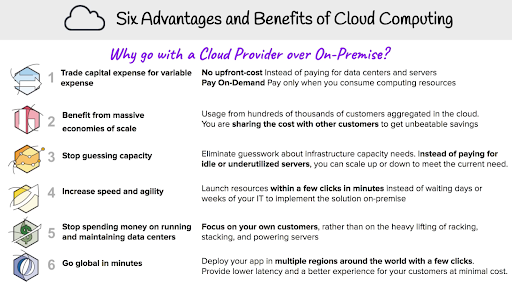
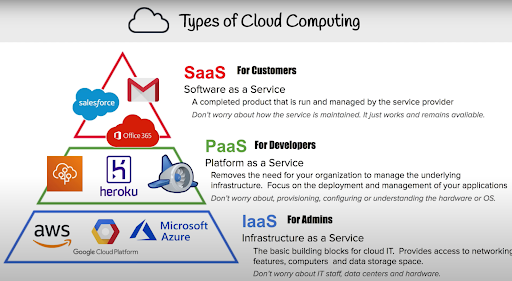
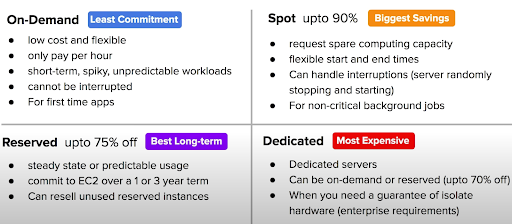
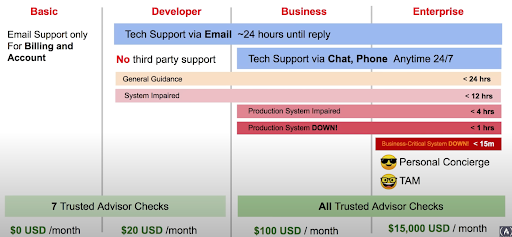
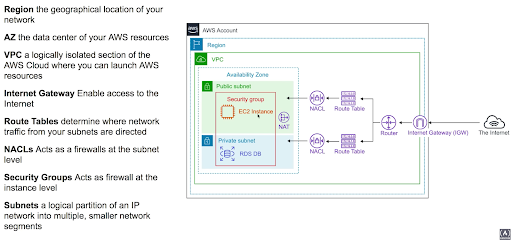
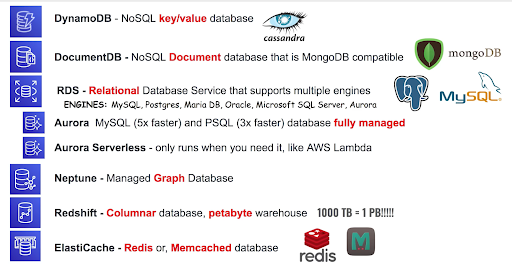
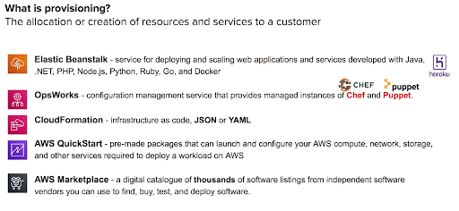
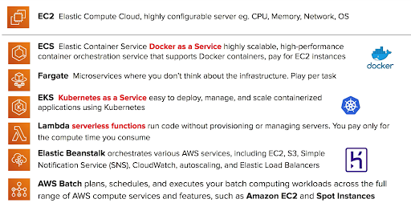

**AWS CCP - Certified Cloud Certification**

Focuses on billing and business-centric concepts.

- $100USD, 90mins, 65 questions, 70% passing score, valid for 3 years.

**Exam Guide**: 
Cloud concepts - 28%
Security - 24%
Technology - 36%
Billing and Pricing - 12%

**Cloud computing**: the practice of using a network of remote servers hosted on the internet to store, manage, and process data, rather than a local server or a personal computer.

**On-Premise:** You own the server, you hire IT people, you take all the risk.
Cloud Providers: someone else owns servers, hire people to mange, you are responsible for your configuring cloud services and code, someone else take care of the rest.

**Six Advantages and benefits of cloud computing:**

**Cloud Concepts: Types**

---

**Cloud computing deployment models**:

**Cloud** - fully utilizing cloud computing 
	Like startups, saas offerings, new projects and companies

**Hybrid** - using both cloud and on-premise
	Like banks, fintech, investment managements, legacy on-premise

**On-Premise** - deploying resources on premise using virtualization and resource management tools, sometimes called a private cloud.
- Better for the public sector eg govt, hospitals, insurance companies.

---

**AWS Global Infrastructure**:
Regions, Availability Zones (AZs), Edge locations.

Region: physical location with multiple AZs.

AZ: one or more discrete data centers

Edge Location: datacenter owned by a trusted partner by AWS.

**Regions**: location which has multiple data centers(AS’s)
- Each region has at least 2 AZs
- AWS largest region is US-East (north virginia)

**AZs**: is a datacenter owned and operated by AWS in which AWS services run.
- are represented by a region code, followed by letter identifier
	Eg: us-east-1a here the last letter a is the AZ
- < 10ms latency bw AZs

**Edge locations**: is a datacenter owned by a trusted partner of AWS  which has a direct connection to the AWS network.
- these locations serve requests for cloudfront and route 53. Requests going to either of these services will be routed to the nearest edge location automatically.
- S3 transfer acceleration traffic and API Gateway endpoint traffic also use the AWS Edge network. 
- This allows for low latency no matter where the end user is geographically located.

**GovCloud(US) Regions**:
AWS GovCloud regions allow customers to host sensitive Controlled Unclassified Information and other types  of regulated workloads.
- these are only operated by employees who are US citizens, on US soil.

---

**AMI** - Amazon Machine Image- copy of entire server

---

**EC2 Pricing Model**:

**On-Demand**: by default, no up-front payment and no long-term commitment.
- charged by hour or minutes
- This is for applications where workload is short-term, spikey or unpredictable. When you have a new app for dev or you want to run an experiment.

**Reserved Instances(RI)**: - best long term savings.
- Designed for applications that have steady state, predictable usage or reserved capacity.
- Reduced pricing is based on the Term * Class Offering * Payment Option.

**Spot Instances**: AWS has unused compute capacity that they want to maximize the utility of their idle servers. 
90% discount than on demand pricing.
* spot instances can be terminated if the computing capacity is needed for on-demand customers.

**Dedicated Host Instances**:

Multi tenant - think apartment - multiple customers are running workloads on shared hardware. Virtual isolation separates customers.
SIngle tenant - think individual house - single customer has dedicated hardware. Physical Isolation separates customers.

---

**AWS Support Plans**:

---

**AWS Networking**:

---

**Database Services**:

---

**Provisioning**:

---

**Computing**:

---

